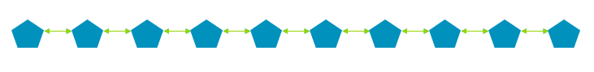
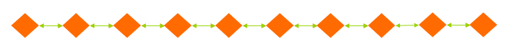
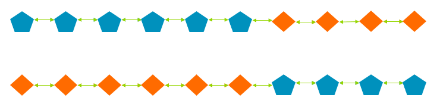
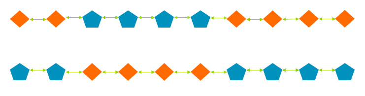
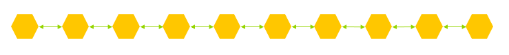
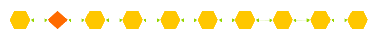
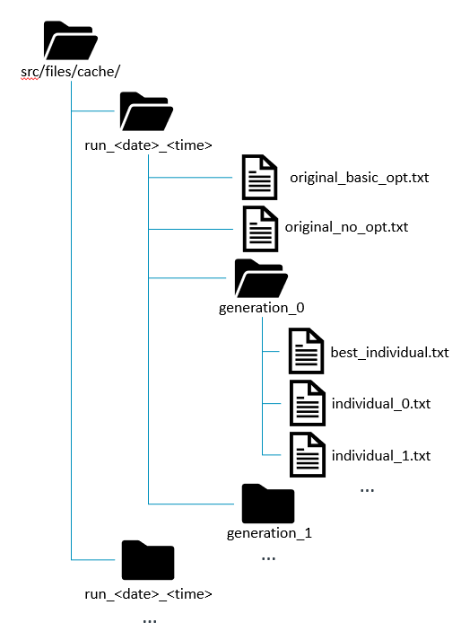

All details of the implementation of evolution within Shackleton are held in this folder. Evolution.h serves as the top-level file in this folder and utilizes all other files in this folder to do the actual evolution passes that are used.

**---- Crossover ----**

This application implements multiple versions of the crossover operator. Regardless of type, crossover takes in two individuals and combines their genetic material in order to create two new individuals from them.

**Basic One Point Crossover**

Basic one point crossover chooses only one point at which the two individuals will share their "genetic material". If the two individuals have the same length, then any point can be chosen. If one of them is longer than the other, then a point is chosen within the shorter of the two. Each individual is split into two sections at the point taken. Then, the first section of one individual is joined with the last section of the other to form two new individuals. For example, given these two individuals:

if we were to perform basic one point crossover on them at point 7, the result would be these two individuals:

**Basic Two Point Crossover**

Basic two point crossover builds off of basic one point crossover and simply performs basic one point crossover twice on the same individuals. Basic two point crossover does not guarantee that the two points chosen will be different values, so it is possible that basic one point crossover will be applied at the same point twice, effectively leaving the individuals unchanged.

**Two Point Crossover Diff**

This version of two point crossover guarantees that the two points chose for crossover will be different points. This means that one each individual resulting from this operator will consist of the head and tail nodes of one individual, and some body nodes of the other. For instance, given the same inidividuals shown about for one point crossover, if they were to have this two point crossover performed at point 3 and at point 7, the result would be these new individuals:

**---- Mutation ----**

Currently only one mutation operator in the Shackleton Framework. This mutation operator picks a single node from an osaka structure and changes all parameters within that node with a uniform probability. If given an individual with this representation:

the application of the mutation operator once may result in an individual with this representation:

The actual nature of the mutation will depend on the internal unit being mutated. Some modules have attributes for which there are a finite number of valid values. If that is the case, then when going through mutation, that attribute will only take on a new value that exists in a known list of valid values. If the attribute does not have a finite list of valid values, then a completely random value of the appropriate type will be loaded to it. All attributes of the mutated node will change, but it is not guaranteed that the value will be different before and after the mutation.

**---- Selection ----**

Selection is the operator by which individuals from one generation are selected to be the parents of the next generation, to be mutated and crossed with one another and create new individuals. The main selection operator used in the Shackleton tool is tournament selection. For a k-way tournament, k individuals are chosen from the previous generation and the individual in that k size group with the highest fitness becomes a parent for the next generation. During each iteration of evolution, tournament selection is repeated until the final population size is at the target.

**---- Top-level Evolution ----**

At the top-level of shackleton, evolution utilizes all of the tools that are described above. The shackleton tool takes in the following parameters:

-  generations <int>: The maximum number of generations that will be created during the course of the evolutionary process.
-  population_size <int>: The target size of each population.
-  crossover <int>: The percent chance that crossover will occur for any given individual in the population. The final percent chance is treated as <int>/100%
-  mutation <int>: The percent chance that mutation will occur for any given individual in the population The final percent chance is treated as <int>/100%
-  visualization: A flag that indicates if visualization of the process will be used. If the flag is present in the command then visualization will be used, it will not be used otherwise.

These parameters are set by the user and are passed to the respective operators that use them.

**---- Caching ----**

When caching is enabled for an evolutionary run, information from that run will be saved in a folder titled run_date_time where date and time are represented as MM_DD_YYYY and HH_MM_SS respectively. You can see a view of the final folder that is created for any given run using the caching functionality. The infomation cached includes a description of every individual in every generation with their fitness value, the best individual for each generation, and other general information about the run and its iterations.

