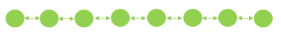
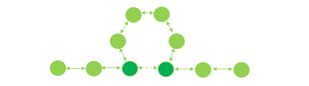
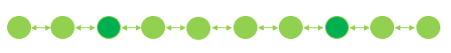
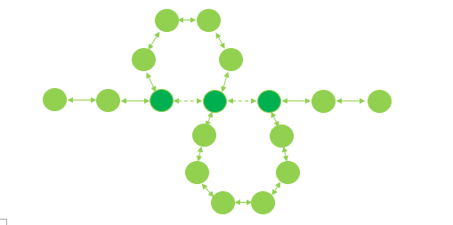
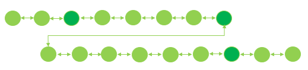

Osaka is our name for the generic genetic object (GGO) that represents what will be evolved in the bulk of the process in Shackleton. Any access to data values ultimately passes through the osaka structure, and running a piece of code amounts to executing an osaka structure from head to tail.

The osaka structure is a doubly linked list of node_str objects, which contains the following items:

    - uid: a universal id
    - objtype: the type of the internal object in a node, specific to the Shackleton framework
    - object_ptr: a pointer to the internal object represented by the node
    - last_ptr: pointer to the node before the current node in the linked list
    - next_ptr: pointer to the node after the current node in the linked list
    - last_link: If a part of a conditional/loop construct, points to the last node in the construct with it
    - next_link: If a part of a conditional/loop construct, points to the next node in the construct with it.
    
The generic nature of the Shackleton framework comes from the fact that any object_type that exists in the Shackleton framework can reside in a node_str object. Additional object types can be created by following the steps laid out in Shackleton/editor_tool/README.md.

An osaka structure can be visualized as a simple doubly linked list, such as this:

Even though the osaka structure can implement conditional and loop structures (future work at the writing of this readme), any osaka structure that satisfies this can also be "unravelled" and be represented as a normal, completely linear individual. Here is an example of an osaka structure that contains a single conditional if...then statement:

Once this individual is unravelled, they can be represented like this:

Similarly, here is an individual that contains an if...then...else statement:

and when this individual is unravelled, here is the result:

In the above visualization, nodes with a light green color represent regular nodes that will be executed as they are and are not explicitly linked to other nodes in any way outside of the overall doubly linked list structure. The nodes with the darker green color represent the nodes that are included in the structural elements of the if…then (…else) construct. 